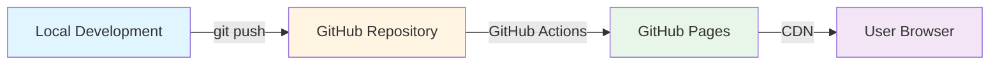

# Design Document: Personal Portfolio Website

## Overview

This design document specifies the technical architecture for spencersanford.com, a static personal portfolio website. The site showcases professional experience, artistic works, and technical capabilities using pure HTML5, CSS3, and vanilla JavaScript, deployed on GitHub Pages.

### Design Philosophy

The design prioritizes simplicity, maintainability, and performance. By avoiding frameworks and build tools, we achieve:
- Zero build complexity - direct deployment from source
- Maximum performance - no framework overhead
- Long-term maintainability - no dependency updates required
- Educational value - clear, readable code for learning

### Key Technical Decisions

1. **No Framework Approach**: Pure vanilla JavaScript eliminates dependencies and reduces complexity
2. **CSS Custom Properties**: Centralized theming enables consistent visual design and easy updates
3. **Progressive Enhancement**: Core content accessible without JavaScript, enhanced with interactivity
4. **Mobile-First CSS**: Base styles for mobile, enhanced with media queries for larger screens
5. **Semantic HTML**: Proper element usage ensures accessibility and SEO benefits

## Architecture

### System Architecture

The website follows a traditional static site architecture with client-side rendering:

```
┌─────────────────────────────────────────────────────────────┐
│                        Browser                               │
│  ┌──────────────────────────────────────────────────────┐  │
│  │              HTML Document (index.html)               │  │
│  │  ┌────────────────────────────────────────────────┐  │  │
│  │  │         Navigation Component (nav)             │  │  │
│  │  └────────────────────────────────────────────────┘  │  │
│  │  ┌────────────────────────────────────────────────┐  │  │
│  │  │         Content Sections (main)                │  │  │
│  │  │  • Technology Section                          │  │  │
│  │  │  • Experience Section                          │  │  │
│  │  │  • Art Portfolio Section                       │  │  │
│  │  └────────────────────────────────────────────────┘  │  │
│  └──────────────────────────────────────────────────────┘  │
│                                                              │
│  ┌──────────────┐  ┌──────────────┐  ┌──────────────┐     │
│  │   styles.css │  │   script.js  │  │   images/    │     │
│  └──────────────┘  └──────────────┘  └──────────────┘     │
└─────────────────────────────────────────────────────────────┘
                            │
                            ▼
                  ┌──────────────────┐
                  │  GitHub Pages    │
                  │  Static Hosting  │
                  └──────────────────┘
```

### File Structure

```
/
├── index.html              # Main HTML document (single-page application)
├── css/
│   ├── styles.css         # Main stylesheet with custom properties
│   ├── critical.css       # Critical above-the-fold styles (inline)
│   └── responsive.css     # Media queries for breakpoints
├── js/
│   ├── navigation.js      # Navigation and scroll handling
│   ├── responsive.js      # Viewport detection and layout adaptation
│   └── assets.js          # Image format detection and lazy loading
├── images/
│   ├── portfolio/         # Art portfolio images
│   │   ├── *.webp        # WebP format (primary)
│   │   └── *.jpg         # JPEG fallback
│   ├── experience/        # Experience section images
│   └── icons/            # UI icons and favicon
├── content/
│   └── data.json         # Structured content data (optional enhancement)
└── README.md             # Documentation for content updates
```

### Deployment Architecture



## Components and Interfaces

### 1. Navigation Component

**Purpose**: Provides site-wide navigation and section switching

**HTML Structure**:
```html
<nav class="main-nav" role="navigation" aria-label="Main navigation">
  <ul class="nav-list">
    <li><a href="#technology" class="nav-link" aria-current="page">Technology</a></li>
    <li><a href="#experience" class="nav-link">Experience</a></li>
    <li><a href="#art" class="nav-link">Art Portfolio</a></li>
  </ul>
</nav>
```

**JavaScript Interface**:
```javascript
// navigation.js
const Navigation = {
  init: function() {
    // Initialize navigation event listeners
    // Set up smooth scrolling
    // Handle active state updates
  },
  
  scrollToSection: function(sectionId) {
    // Smooth scroll to section
    // Update URL hash
    // Update active state
  },
  
  updateActiveState: function(sectionId) {
    // Remove active class from all links
    // Add active class to current link
    // Update aria-current attribute
  }
};
```

**CSS Custom Properties**:
```css
:root {
  --nav-height: 60px;
  --nav-bg: #ffffff;
  --nav-text: #333333;
  --nav-active: #0066cc;
}
```

### 2. Technology Section Component

**Purpose**: Displays technical information about the website implementation

**HTML Structure**:
```html
<section id="technology" class="content-section">
  <h2>Technology</h2>
  <div class="tech-grid">
    <article class="tech-item">
      <h3>Architecture</h3>
      <p>Static site with zero dependencies</p>
    </article>
    <article class="tech-item">
      <h3>Hosting Costs</h3>
      <p>GitHub Pages: $0/month</p>
      <p>Domain: ~$12/year</p>
    </article>
    <article class="tech-item">
      <h3>Performance</h3>
      <p>Load time: <span id="load-time"></span>ms</p>
      <p>Total size: <span id="total-size"></span>KB</p>
    </article>
  </div>
</section>
```

### 3. Experience Section Component

**Purpose**: Displays professional experience, hackathons, classes, and projects

**HTML Structure**:
```html
<section id="experience" class="content-section">
  <h2>Professional Experience</h2>
  
  <div class="experience-category">
    <h3>Work Experience</h3>
    <ul class="experience-list">
      <li class="experience-item">
        <h4 class="experience-title">Job Title</h4>
        <time class="experience-date" datetime="2023-01">January 2023</time>
        <p class="experience-description">Description of role and achievements</p>
      </li>
    </ul>
  </div>
  
  <div class="experience-category">
    <h3>Hackathons</h3>
    <ul class="experience-list">
      <!-- Similar structure -->
    </ul>
  </div>
  
  <div class="experience-category">
    <h3>Education</h3>
    <ul class="experience-list">
      <!-- Similar structure -->
    </ul>
  </div>
  
  <div class="experience-category">
    <h3>Personal Projects</h3>
    <ul class="experience-list">
      <!-- Similar structure -->
    </ul>
  </div>
</section>
```

### 4. Art Portfolio Section Component

**Purpose**: Displays creative works including reviews, prose, and visual art

**HTML Structure**:
```html
<section id="art" class="content-section">
  <h2>Art Portfolio</h2>
  
  <div class="art-category">
    <h3>Reviews</h3>
    <div class="art-grid">
      <article class="art-item">
        <h4>Review Title</h4>
        <p class="art-meta">Book/Movie/Show - Date</p>
        <p class="art-excerpt">Brief excerpt...</p>
        <button class="read-more" aria-expanded="false">Read More</button>
        <div class="art-full-content" hidden>
          <p>Full review content...</p>
        </div>
      </article>
    </div>
  </div>
  
  <div class="art-category">
    <h3>Prose</h3>
    <div class="art-grid">
      <!-- Similar structure -->
    </div>
  </div>
  
  <div class="art-category">
    <h3>Visual Art</h3>
    <div class="art-grid">
      <figure class="art-item">
        <picture>
          <source srcset="images/portfolio/artwork.webp" type="image/webp">
          
        </picture>
        <figcaption>Artwork Title - Medium</figcaption>
      </figure>
    </div>
  </div>
</section>
```

### 5. Responsive Layout System

**Purpose**: Adapts layout based on viewport size

**JavaScript Interface**:
```javascript
// responsive.js
const ResponsiveLayout = {
  breakpoints: {
    mobile: 768,
    tablet: 1024
  },
  
  currentBreakpoint: null,
  
  init: function() {
    this.checkBreakpoint();
    window.addEventListener('resize', this.debounce(this.checkBreakpoint.bind(this), 250));
  },
  
  checkBreakpoint: function() {
    const width = window.innerWidth;
    let newBreakpoint;
    
    if (width < this.breakpoints.mobile) {
      newBreakpoint = 'mobile';
    } else if (width < this.breakpoints.tablet) {
      newBreakpoint = 'tablet';
    } else {
      newBreakpoint = 'desktop';
    }
    
    if (newBreakpoint !== this.currentBreakpoint) {
      this.currentBreakpoint = newBreakpoint;
      document.body.setAttribute('data-breakpoint', newBreakpoint);
      this.applyBreakpointStyles();
    }
  },
  
  applyBreakpointStyles: function() {
    // Adjust layout-specific JavaScript behaviors
  },
  
  debounce: function(func, wait) {
    let timeout;
    return function() {
      clearTimeout(timeout);
      timeout = setTimeout(() => func.apply(this, arguments), wait);
    };
  }
};
```

### 6. Asset Loading System

**Purpose**: Optimizes image loading with format detection and lazy loading

**JavaScript Interface**:
```javascript
// assets.js
const AssetLoader = {
  supportsWebP: false,
  
  init: function() {
    this.detectWebPSupport();
    this.setupLazyLoading();
  },
  
  detectWebPSupport: function() {
    const canvas = document.createElement('canvas');
    if (canvas.getContext && canvas.getContext('2d')) {
      this.supportsWebP = canvas.toDataURL('image/webp').indexOf('data:image/webp') === 0;
    }
    document.documentElement.classList.add(this.supportsWebP ? 'webp' : 'no-webp');
  },
  
  setupLazyLoading: function() {
    if ('IntersectionObserver' in window) {
      const imageObserver = new IntersectionObserver((entries) => {
        entries.forEach(entry => {
          if (entry.isIntersecting) {
            const img = entry.target;
            this.loadImage(img);
            imageObserver.unobserve(img);
          }
        });
      });
      
      document.querySelectorAll('img[loading="lazy"]').forEach(img => {
        imageObserver.observe(img);
      });
    }
  },
  
  loadImage: function(img) {
    if (img.dataset.src) {
      img.src = img.dataset.src;
      img.removeAttribute('data-src');
    }
  }
};
```

## Data Models

### Content Structure

Since this is a static site without a database, content is embedded directly in HTML. However, we define consistent data structures for each content type:

**Experience Item**:
```javascript
{
  title: String,        // "Software Engineer" or "HackMIT 2023"
  date: String,         // ISO 8601 format "2023-01-15"
  dateDisplay: String,  // "January 2023"
  description: String,  // Markdown or plain text
  category: String,     // "work" | "hackathon" | "education" | "project"
  link: String          // Optional external link
}
```

**Art Portfolio Item**:
```javascript
{
  title: String,
  category: String,     // "review" | "prose" | "visual"
  subcategory: String,  // For reviews: "book" | "movie" | "show" | "anime"
  date: String,         // ISO 8601 format
  excerpt: String,      // Brief preview (150 chars)
  content: String,      // Full content (HTML)
  media: {              // For visual art
    webp: String,       // Path to WebP image
    fallback: String,   // Path to JPEG/PNG
    alt: String         // Accessibility description
  }
}
```

**Technology Metrics**:
```javascript
{
  loadTime: Number,     // Page load time in milliseconds
  totalSize: Number,    // Total page size in KB
  requestCount: Number, // Number of HTTP requests
  hostingCost: String   // "$0/month (GitHub Pages)"
}
```

### CSS Custom Properties Schema

All design tokens are defined as CSS custom properties for consistency:

```css
:root {
  /* Colors */
  --color-primary: #0066cc;
  --color-secondary: #6c757d;
  --color-background: #ffffff;
  --color-surface: #f8f9fa;
  --color-text: #212529;
  --color-text-secondary: #6c757d;
  --color-border: #dee2e6;
  --color-focus: #0066cc;
  
  /* Typography */
  --font-primary: 'Georgia', serif;
  --font-secondary: 'Helvetica Neue', Arial, sans-serif;
  --font-mono: 'Courier New', monospace;
  
  --font-size-base: 16px;
  --font-size-small: 14px;
  --font-size-large: 18px;
  --font-size-h1: 36px;
  --font-size-h2: 28px;
  --font-size-h3: 22px;
  --font-size-h4: 18px;
  
  --line-height-base: 1.6;
  --line-height-heading: 1.2;
  
  /* Spacing */
  --spacing-xs: 4px;
  --spacing-sm: 8px;
  --spacing-md: 16px;
  --spacing-lg: 24px;
  --spacing-xl: 32px;
  --spacing-xxl: 48px;
  
  /* Layout */
  --max-width: 1200px;
  --nav-height: 60px;
  --section-padding: var(--spacing-xxl);
  
  /* Transitions */
  --transition-fast: 150ms ease;
  --transition-base: 250ms ease;
  --transition-slow: 350ms ease;
  
  /* Shadows */
  --shadow-sm: 0 1px 3px rgba(0, 0, 0, 0.1);
  --shadow-md: 0 4px 6px rgba(0, 0, 0, 0.1);
  --shadow-lg: 0 10px 15px rgba(0, 0, 0, 0.1);
  
  /* Borders */
  --border-radius-sm: 4px;
  --border-radius-md: 8px;
  --border-radius-lg: 12px;
}
```


### Responsive Breakpoint Overrides

```css
/* Mobile (<768px) - Base styles */
.content-section {
  padding: var(--spacing-lg);
}

.art-grid,
.tech-grid {
  grid-template-columns: 1fr;
  gap: var(--spacing-md);
}

/* Tablet (768px-1024px) */
@media (min-width: 768px) {
  .content-section {
    padding: var(--spacing-xl);
  }
  
  .art-grid,
  .tech-grid {
    grid-template-columns: repeat(2, 1fr);
    gap: var(--spacing-lg);
  }
}

/* Desktop (>1024px) */
@media (min-width: 1024px) {
  .content-section {
    padding: var(--spacing-xxl);
    max-width: var(--max-width);
    margin: 0 auto;
  }
  
  .art-grid {
    grid-template-columns: repeat(3, 1fr);
  }
  
  .tech-grid {
    grid-template-columns: repeat(3, 1fr);
  }
}
```

